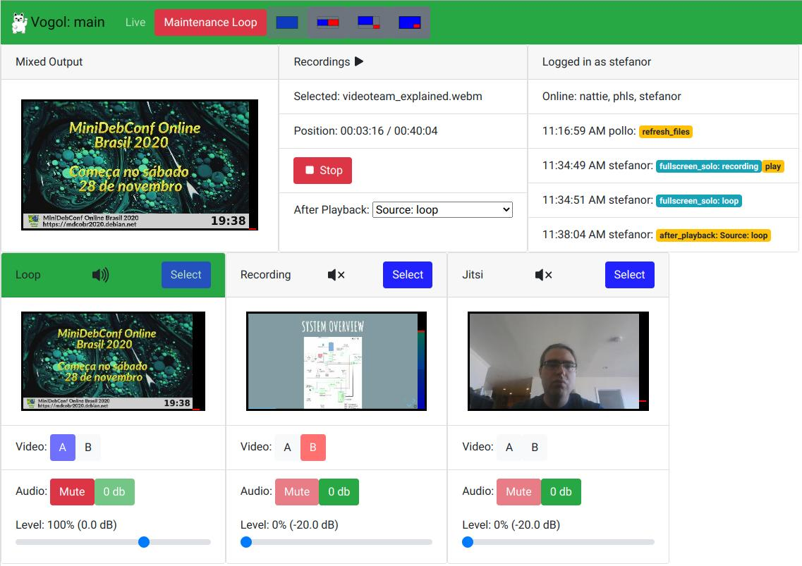

# Vogol

Vogol (VOctomix Gui OnLine) is a Web Interface to [voctomix 1.x][].

[VoctoMix 1.x]: https://github.com/voc/voctomix/tree/master

It acts as a web equivalent to `voctogui`, displaying roughly the same
controls, but through the web.

Vogol has some features beyond voctogui:

 * Authentication: OIDC SSO (currently only from GitLab instances).
 * Playback of pre-recorded video files into a voctomix source.
 * A live log of other connected users' actions.
 * VU meters on every source.
 * Preset layouts.

Missing features compared to voctogui:

 * Live video preview. Video previews are 1fps thumbnails.
 * Live audio preview. Only VU meters.

So, you'll need to use a separate video player to monitor the output
stream.

Once gstreamer's webrtc support becomes stable, live previews may be
straightforward to implement.

## Development

There are two parts to vogol, a Python asyncio + gstreamer backend, and
a Vue.js frontend. They communicate via a websocket.

### Frontend

There is a **README** for frontend in its directory.
It can be developed stand-alone against a remote backend or locally.

### Voctocore

The backend + voctocore can be quite CPU-intensive. It helps to use a
lower resolution (e.g. `640x360`) in the voctocore mix videocaps.

Stream mirrors need to be enabled. Previews aren't used.

### Backend

1. Install the python requirements (Debian packages or virtualenv).
1. Run vogol: `python -m vogol -c example.ini`
1. Browse to http://127.0.0.1:8080/

## Screenshots

